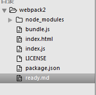
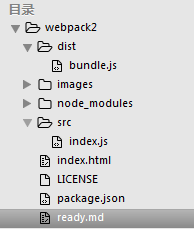
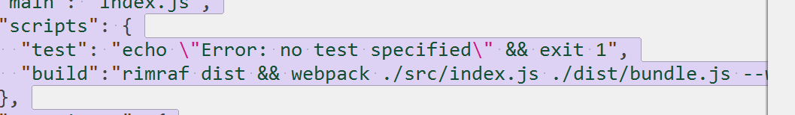

 webpack2 详细部署
------------------
# 第一次提交
>1.在github上创建一个新的库，然后用git复制下来
>2.npm install http-server -g 下载本地服务器
>3.npm init  初始化package.json文件
>4.创建index.html index.json文件
>5.npm install webpack --save-dev 
>6./node_modules/webpack/bin/webpack.js index.js bundle.js  输入以上指令创建bundle.js文件 
>7.在index.html文件中引用bundle.js文件
>8.运行http-server -p 3000 打开本地端口3000就可以运行了
>当前页面结构

# 第二次提交
>1.创建src dist 文件 src放入index.js文件
>2.npm install rimraf --save-dev 
>3.改动package.json.文件的命令 "build":"rimraf dist && webpack ./src/index.js ./dist/bundle.js --watch"
>当前页面结构  
